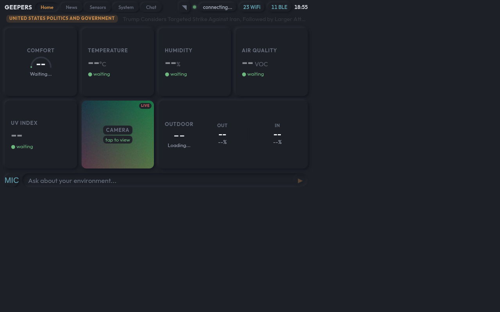
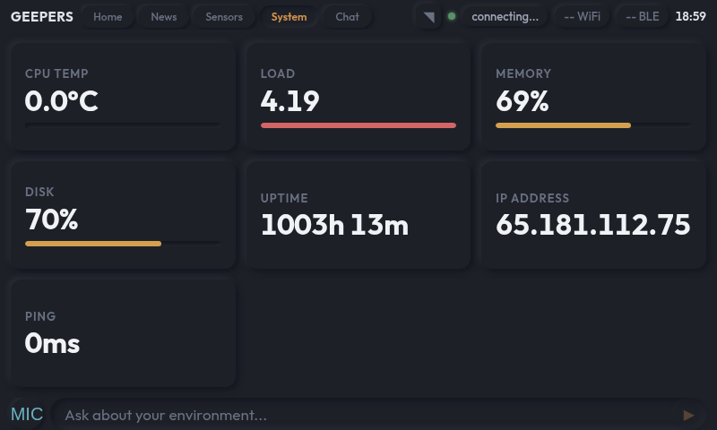
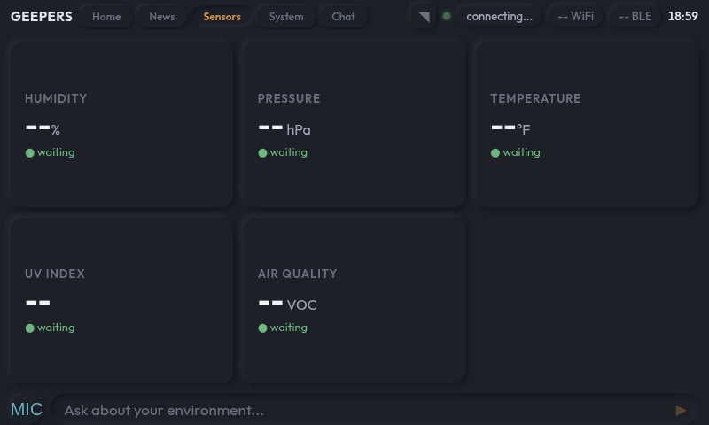
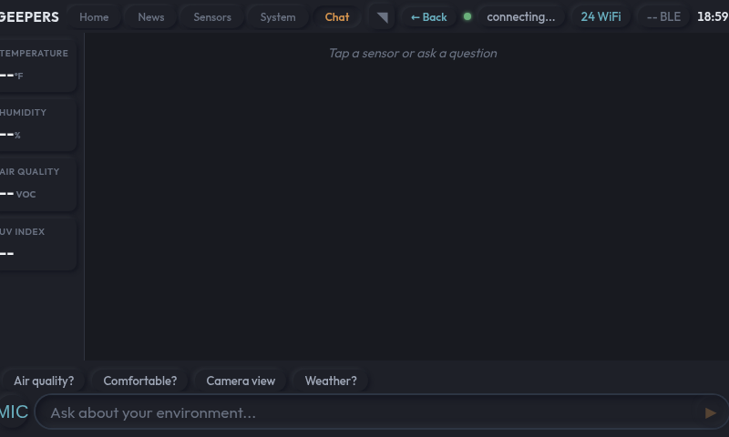

# Geepers Home

A Raspberry Pi sensor dashboard with three runtime modes: a Flask web dashboard, a tkinter touchscreen GUI, and a classic tab-based browser. Reads 23 sensors over I2C, GPIO, 1-Wire, and ADC — with a webcam, browser-based voice input, and LLM chat.

> **Work in progress.** The web dashboard (v4.1) is the active development path. The tkinter modes still work but are no longer the focus.

> **LLM backend.** Designed to run with a local [Ollama](https://ollama.com) instance — point `CHAT_ENDPOINT` at your Ollama server and no cloud dependency is needed for chat. Currently wired to the [dr.eamer.dev API gateway](https://dr.eamer.dev/code/api) which supports Ollama, Anthropic, OpenAI, Mistral, and others. Without a configured endpoint the dashboard works fine for local sensor data; chat, voice, and camera scene description are just unavailable.


## Screenshots

| Home | System |
|------|--------|
|  |  |

| Sensors | Chat |
|---------|------|
|  |  |

## Runtime Modes

| Mode | Entry Point | What it is |
|------|-------------|------------|
| **Web dashboard (v4.1)** | `web_app.py` | Flask server, SSE streaming, chat, voice, history graphs |
| **Home Station (v3)** | `main.py` | Tkinter card-based GUI loaded from `dashboard.yaml` |
| **Classic (v1/v2)** | `main.py --classic` / `--legacy` | Legacy tkinter tab browser and single-page dashboard |

## Features

- Reads 23 sensors: DHT11, DS18B20, PIR, tilt, reed, hall, flame, touch, button, knock, sound, light, BME280, TSL25911, LTR390, SGP40, ICM20948, soil moisture, sound level, light level, joystick, RGB LED, buzzer
- Demo mode — realistic simulated readings for every sensor, no hardware required
- LLM chat with live sensor context, proxied to `api.dr.eamer.dev/v1/llm/chat`
- Browser voice input (MediaRecorder → Whisper STT at `api.dr.eamer.dev/v1/voice/transcribe`)
- Scene description via USB webcam + vision model at `dr.eamer.dev/pivision/api/analyze`
- SQLite time-series storage with adaptive-resolution history queries
- Threshold alert system defined in `dashboard.yaml`
- WiFi and Bluetooth scanning (requires passwordless sudo for `iw` and `hcitool`)
- Weather via Open-Meteo (no API key), news via NYT RSS

## Quick Start

```bash
# Install system + Python deps
bash setup.sh

# Web dashboard (default, port 5000)
python3 web_app.py
python3 web_app.py --demo        # Simulated sensors

# Tkinter Home Station
python3 main.py
python3 main.py --demo

# Deploy to Pi from VPS
bash deploy.sh
bash deploy.sh --service restart
```

## Hardware

| Component | Notes |
|-----------|-------|
| Raspberry Pi 3B / 3B+ / 4 / 5 | Target platform |
| 800×480 touchscreen | Tested with Freenove 7" DSI |
| 37-in-1 sensor kit | GPIO sensors |
| ADS1115 ADC breakout | Required for analog sensors (sound level, light level, soil moisture, joystick) |
| USB webcam (Brio 100) | Camera + microphone for voice input |
| SSD1306 OLED (optional) | Secondary 128×64 display |

Boot config required for I2C and 1-Wire:

```ini
dtparam=i2c_arm=on
dtoverlay=w1-gpio,gpiopin=12
```

## Architecture

The web dashboard uses a plugin-based pub/sub framework:

- **`WebEventBus`** — thread-safe pub/sub; background sensor threads publish, SSE endpoint streams to browser
- **`DataSource`** ABC — subclasses implement `fetch()`, base handles polling + threading + publish
- **`DataStore`** — SQLite with WAL mode; 7-day raw retention, auto-downsamples to hourly averages
- **`AlertManager`** — threshold rules from `dashboard.yaml`; publishes `"alert"` events to the bus

All sources and cards self-register via `@register_source` / `@register_card` decorators. `dashboard.yaml` is the single config for sources, pages, and alert rules.

The Pi connects to the VPS via a reverse SSH tunnel. `deploy.sh` rsyncs code and can restart the systemd service and refresh Chromium (kiosk mode, Wayland).

## LLM Backend

The chat interface proxies to a configurable endpoint that accepts a `provider` + `model` field, so any backend works:

| Provider | How to use |
|----------|-----------|
| **Ollama** (recommended, local) | Run Ollama on a Pi or LAN machine, set `CHAT_ENDPOINT=http://your-ollama-host:11434/api/chat` |
| **dr.eamer.dev gateway** (default) | Supports Ollama, Anthropic, OpenAI, Mistral, and others — set `DREAMER_API_KEY` |
| **Any OpenAI-compatible API** | Set `CHAT_ENDPOINT` to any endpoint that accepts the same request shape |

The `provider` and `model` sent with each chat request are passed through as-is, so switching models is just a frontend config change.

Voice STT and vision analysis currently use the dr.eamer.dev endpoints (`VPS_URL`). Swapping those for local alternatives (e.g. Whisper.cpp, LLaVA) is on the roadmap.

## Adding Sensors

1. Create `sensors/my_sensor.py` inheriting from `BaseSensor` (or `DigitalSensor` for simple GPIO threshold sensors)
2. Implement `_init_hardware()`, `_read_hardware()`, `_simulate()`
3. Register in `sensors/__init__.py` (`SENSOR_CLASSES` dict)
4. Add a `sources:` entry in `dashboard.yaml`

## Deployment (Pi)

```bash
# From VPS — sync code + restart service
bash deploy.sh && bash deploy.sh --service restart

# Pi service management
sudo systemctl status sensor-playground-web
sudo journalctl -u sensor-playground-web -f

# SSH to Pi through reverse tunnel
ssh -p 2222 coolhand@localhost
```

The Pi runs the web dashboard as `sensor-playground-web.service`. Chromium runs in kiosk mode (Wayland/labwc) and auto-refreshes via `wtype -k F5` on deploy.

## Troubleshooting

| Symptom | Fix |
|---------|-----|
| DHT11 returns None often | Normal — ~30% failure rate, retry logic handles it |
| No 1-Wire device | Add `dtoverlay=w1-gpio,gpiopin=12` to boot config and reboot |
| ADC / OLED not found | `i2cdetect -y 1` — ADS1115 at 0x48, SSD1306 at 0x3C |
| WiFi scan fails | Add passwordless sudo for `/usr/sbin/iw` in `/etc/sudoers.d/sensor-playground` |
| Chat/voice not working | Check `VPS_URL` and that `api.dr.eamer.dev` is reachable |

## Author

**Luke Steuber**
- [lukesteuber.com](https://lukesteuber.com)
- Bluesky: [@lukesteuber.com](https://bsky.app/profile/lukesteuber.com)

MIT License
